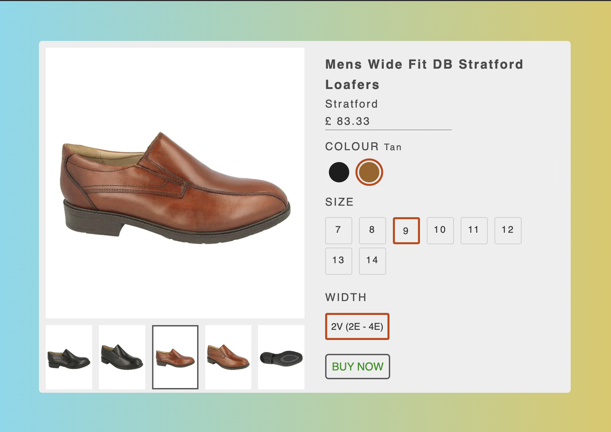
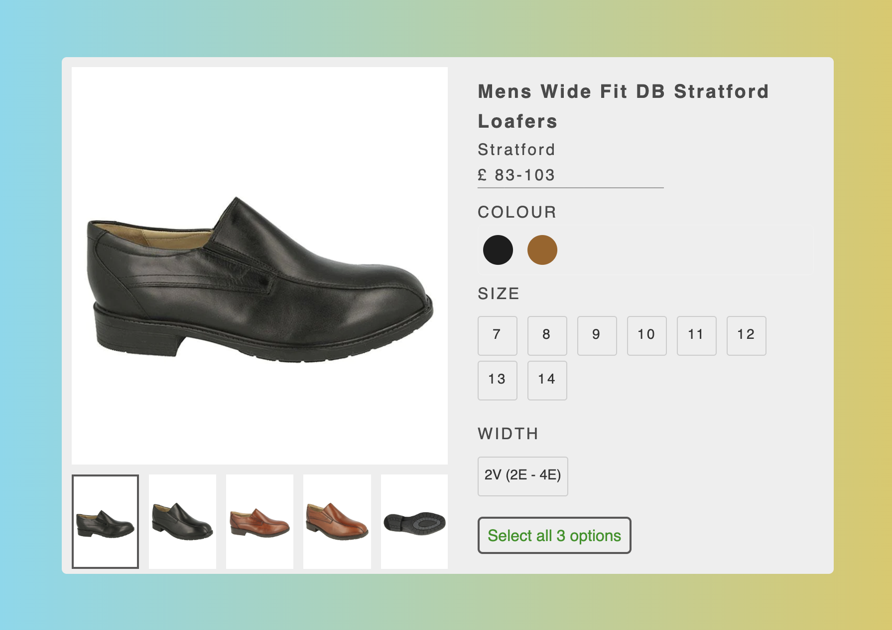

## Project Intro

Ecommerce product selection UI design using React, Redux Toolkit for State Management and Thunk Middleware for async API calls.

- User can select color, size and width of the shoes.
- Based on this info the right variant will be selected

## UI Screenshot

## Topics Covered

- React
- Redux Toolkit and Thunk Middleware
- React Hooks: useState
- JS Higher Order Function: Map and Filter
- CSS Flex Box

## Available Scripts

1. Install all needed NPM packages by typing: `npm install` in the current directory's terminal.

2. To Run the app type `npm run dev` in the terminal.
